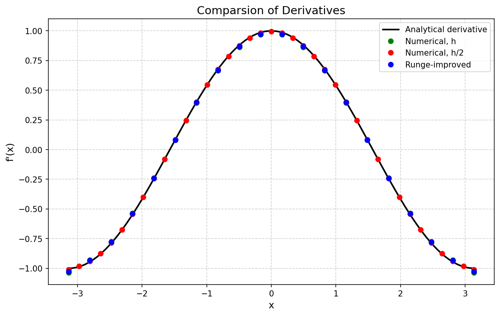

<!DOCTYPE html>
<html>
<head>
<meta charset="UTF-8">
</head>
<body>

<h1>Numerical Differentiation</h1>

  

This program computes the derivative of the function f(x) = sin(x) on the interval [-π, π] using finite-difference formulas. The solution is refined by the Runge–Romberg method. Errors are evaluated in three norms (L₁, L₂, L∞). Two tables with absolute and relative errors are printed, and a plot is displayed.

<h2>Requirements</h2>
<ul>
  <li>C++ compiler with C++17 support (e.g., g++, clang++)</li>
  <li>GNU Make</li>
  <li>Python 3 with matplotlib and numpy (for visualisation)</li>
</ul>

<h2>Quick Start</h2>
<pre><code>
git clone &lt;your-repo-url&gt;
cd &lt;project-folder&gt;
make          # compile the program
make run      # compile and run
</code></pre>

Alternatively, you can run manually:

<pre><code>
make
./numer_diff
</code></pre>

The program will:
<ol>
  <li>Print two error tables to the console.</li>
  <li>Generate parameters.txt with all data.</li>
  <li>Launch create_plot.py to show a graph and save it as plot.png.</li>
</ol>

To clean up:

<pre><code>
make clean
</code></pre>

<h2>Example Output</h2>

After running <code>./numer_diff</code>, the console shows:

<pre>
         table 1: paragraph 7 - printing errors
––––––––––––––––––––––––––––––––––––––––––––––––––––––––––––
|                      |     h     |   h / 2   |   Runge   |
––––––––––––––––––––––––––––––––––––––––––––––––––––––––––––
| Absolute error  (1)  | 2.712e-01 | 1.235e-01 | 2.036e-01 | 
––––––––––––––––––––––––––––––––––––––––––––––––––––––––––––
| Absolute error  (2)  | 7.238e-02 | 2.312e-02 | 5.438e-02 | 
––––––––––––––––––––––––––––––––––––––––––––––––––––––––––––
| Absolute error  (3)  | 3.503e-02 | 9.015e-03 | 2.636e-02 | 
––––––––––––––––––––––––––––––––––––––––––––––––––––––––––––
| Relative error  (1)  | 2.069e-02 | 4.900e-03 | 1.554e-02 | 
––––––––––––––––––––––––––––––––––––––––––––––––––––––––––––
| Relative error  (2)  | 2.234e-02 | 5.170e-03 | 1.679e-02 | 
––––––––––––––––––––––––––––––––––––––––––––––––––––––––––––
| Relative error  (3)  | 3.503e-02 | 9.015e-03 | 2.636e-02 | 
––––––––––––––––––––––––––––––––––––––––––––––––––––––––––––

                table 2: paragraph 8 - compare errors
––––––––––––––––––––––––––––––––––––––––––––––––––––––––––––––––––––––––
|                      |     h     |   h / 2   |   Runge   |main member|
––––––––––––––––––––––––––––––––––––––––––––––––––––––––––––––––––––––––
| Absolute error  (1)  | 2.712e-01 | 1.235e-01 | 2.036e-01 | 6.755e-02 | 
––––––––––––––––––––––––––––––––––––––––––––––––––––––––––––––––––––––––
| Absolute error  (2)  | 7.238e-02 | 2.312e-02 | 5.438e-02 | 1.800e-02 | 
––––––––––––––––––––––––––––––––––––––––––––––––––––––––––––––––––––––––
| Absolute error  (3)  | 3.503e-02 | 9.015e-03 | 2.636e-02 | 8.670e-03 | 
––––––––––––––––––––––––––––––––––––––––––––––––––––––––––––––––––––––––
</pre>

After that, a window with the plot appears (see Results).

<h2>Results</h2>

The generated plot compares:

<ul>
  <li>Analytical derivative (solid line, fine grid)</li>
  <li>Numerical derivative with step h (green dots)</li>
  <li>Numerical derivative with step h/2 (red dots)</li>
  <li>Runge-improved solution (blue dots)</li>
</ul>

  

<em>(PASTE THE PLOT!)</em>

<h2>Project Structure</h2>
<pre>
.
├── Makefile
├── README.md
├── .gitignore
├── create_plot.py          # Python script for plotting
├── src/
│   ├── main.cpp
│   ├── functions.cpp
│   └── functions.h
├── build/                  # object files (ignored)
└── parameters.txt          # generated data (ignored)
</pre>

<h2>Author</h2>

<strong>Name:</strong> Philip Karev @g30613740

<strong>Year:</strong> 2024

<h2>License</h2>

This project is distributed under the MIT License.

</body>
</html>